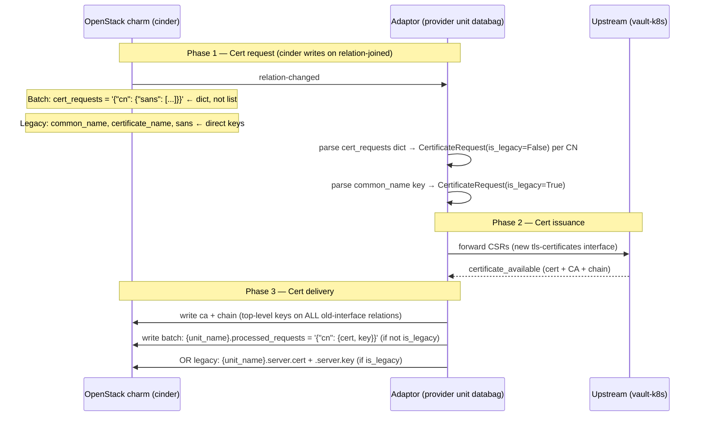

# Fix old-interface (v1) relation data protocol

## Abstract

The adaptor fails to issue certificates to old-interface (v1) requesters (cinder, keystone, nova,
etc.) due to two bugs: (1) **incorrect relation data format** — the adaptor reads cert requests
expecting a JSON list but the reactive interface writes a JSON dict, causing every request to be
silently dropped; and (2) **incorrect response format** — the write path produces output in a
format the reactive requirer cannot read. A secondary concern is **CA propagation**: the adaptor
must also write the upstream CA cert to old-interface relations so that OpenStack charms can trust
issued certificates.

## Rationale

Field testing confirmed: after re-relating cinder to the adaptor, cinder's unit databag contains:

```
cert_requests: '{"juju-a3d692-openstack-0": {"sans": ["10.149.56.105"]}}'
unit_name: cinder_0
```

This is the standard **batch format** written by charmhelpers `CertRequest.get_request()`. The
adaptor calls `json.loads()` on this value, gets a `dict`, then checks
`isinstance(entries, list)` — which is `False` — and logs "cert_requests is not a list" before
skipping the request entirely. Cinder's cert request is silently dropped every time.

### Root cause 1 (confirmed): incorrect cert request parsing

The current `get_certificate_requests()` was written expecting a list of objects with `cert_type`,
`common_name`, and `sans` fields. This format does not exist in the upstream reactive interface.

The reactive interface and charmhelpers write cert requests in two distinct sub-formats:

- **Batch format** (used by charmhelpers `CertRequest.get_request()` and for subsequent certs):
  `cert_requests = '{"<cn>": {"sans": [...]}, ...}'` — a JSON-encoded **dict**
- **Legacy format** (used by the reactive library for the first cert per unit):
  `common_name`, `certificate_name`, `sans` as direct databag keys

The current code handles neither.

### Root cause 2 (confirmed): incorrect response write format

The current `write_certificate()` writes the response as a JSON **list** with `cert_type`,
`common_name`, `cert`, `key`, `ca` fields inside the list. The reactive requirer expects:

- **Batch response**: `{unit_name}.processed_requests = '{"<cn>": {"cert": ..., "key": ...}}'`
  (a JSON dict, `ca` as a separate top-level key)
- **Legacy response**: `{unit_name}.server.cert` and `{unit_name}.server.key` as direct keys

### Secondary concern: CA propagation

The adaptor must also write the upstream CA cert as a `ca` top-level key in its unit databag on
old-interface relations. This is needed for OpenStack charms that use the `{endpoint}.ca.available`
reactive flag to gate further lifecycle steps. The CA can only be written after the upstream
provider issues the first certificate.

## Specification

### Goals

- **[Primary]** Fix `get_certificate_requests()` to correctly parse the **batch format**
  (`cert_requests` JSON dict) and the **legacy format** (`common_name` direct key).
- **[Primary]** Fix `write_certificate()` to write provider responses in the correct format for
  each request type (batch response dict or legacy cert/key keys).
- **[Secondary]** Propagate the upstream CA cert (`ca` and `chain` keys) to all active
  old-interface relations after the first upstream cert is issued so that OpenStack charms that
  gate on `{endpoint}.ca.available` can proceed (see [ADR-2](./001-decision.md#2-ca-propagation-strategy)).
- Maintain the existing `server`-only scope: requests of other types are logged and skipped.
- Keep `charmhelpers` and the reactive `interface-tls-certificates` library **out of the
  dependency tree** (see [ADR-1](./001-decision.md)).

### Non-Goals

- Support for `client`, `application`, or `intermediate` certificate types.
- Cross-app relation data sharing or Juju Secrets for the old interface side.
- Changes to the upstream (new interface) leg of the adaptor.
- Modifying OpenStack requirer charms (cinder, keystone, nova, etc.).

### Background: the old reactive `tls-certificates` (v1) protocol

#### CA advertisement (provider → requirer, written immediately on join)

The reactive `TlsProvides.set_ca()` is called by the old vault charm as soon as the relation is
joined — before any cert requests exist. It writes `ca` (and `chain`) as top-level keys in the
provider's unit databag. On the requirer side, `TlsRequires.joined()` reads these keys and sets
the `{endpoint}.ca.available` flag.

The adaptor cannot replicate this on-join behaviour (the upstream CA is only available after the
first cert is issued). The CA is instead written to old-interface relations on the first
`certificate_available` event from upstream. See the CA propagation section below.

#### Request side (requirer → provider, written by the OpenStack charm)

The reactive `TlsRequires.request_server_cert()` and the charmhelpers `CertRequest.get_request()`
write data into the **requirer's unit databag**. There are two co-existing sub-formats:

**Legacy format** (first cert per unit, backwards-compatible):

| Key                | Type      | Description                                      |
| ------------------ | --------- | ------------------------------------------------ |
| `common_name`      | string    | CN of the certificate                            |
| `certificate_name` | string    | A UUID used as a stable key for the response     |
| `sans`             | JSON list | Subject alternative names (IPs and/or hostnames) |
| `unit_name`        | string    | Munged unit name, e.g. `keystone_0`              |

**Batch format** (used for all certs by charmhelpers `CertRequest.get_request()`, and for
subsequent certs by `request_server_cert()`):

| Key             | Type              | Description                                |
| --------------- | ----------------- | ------------------------------------------ |
| `cert_requests` | JSON-encoded dict | `{"<cn>": {"sans": ["<san1>", ...]}, ...}` |
| `unit_name`     | string            | Munged unit name, e.g. `keystone_0`        |

Both formats may coexist in the same unit databag (one CN in the legacy fields plus additional CNs
in `cert_requests`).

#### Response side (provider → requirer, written by the adaptor into its own unit databag)

The reactive `TlsRequires.server_certs` property reads the issued certificate from the provider's
unit databag using two parallel sub-formats:

**Legacy response format** (for the CN sent in the `common_name` legacy key):

| Key                       | Type   | Description                              |
| ------------------------- | ------ | ---------------------------------------- |
| `{unit_name}.server.cert` | string | PEM-encoded signed certificate           |
| `{unit_name}.server.key`  | string | PEM-encoded private key                  |
| `ca`                      | string | PEM-encoded CA certificate               |
| `chain`                   | string | PEM-encoded chain / intermediate cert(s) |

**Batch response format** (for CNs sent in `cert_requests`):

| Key                              | Type              | Description                                   |
| -------------------------------- | ----------------- | --------------------------------------------- |
| `{unit_name}.processed_requests` | JSON-encoded dict | `{"<cn>": {"cert": "<PEM>", "key": "<PEM>"}}` |
| `ca`                             | string            | PEM-encoded CA certificate                    |
| `chain`                          | string            | PEM-encoded chain / intermediate cert(s)      |

All keys are written into the **adaptor's own unit databag** for the relevant relation.

### Data flow



### CA propagation to old-interface relations

The adaptor must write the upstream CA cert to **all active old-interface relations** (not just
the one associated with the specific certificate) whenever a CA cert is obtained from upstream.
This is needed to:

1. **Enable cert lifecycle**: some OpenStack charm versions gate further steps (e.g. service
   restarts, cert expiry handling) on the `{endpoint}.ca.available` reactive flag, which only
   fires when the provider has written `ca` to the relation.
2. **Keep the CA current**: vault-k8s may rotate its root CA; old-interface relations must be
   updated to reflect the new CA so that OpenStack services trust renewed certs.

#### When to propagate

Propagate `ca` and `chain` to all old-interface relations on every `certificate_available` event
from the upstream, regardless of which relation the cert was issued for. The `ca` should be written
once per relation (not per unit) using `relation.data[self._charm.unit]["ca"]` and
`relation.data[self._charm.unit]["chain"]`.

#### Implementation in `OldTLSCertificatesRelation`

Add a new method:

```python
def write_ca(self, ca: str, chain: str = "") -> None:
    """Write the upstream CA cert to all active old-interface relations.

    Args:
        ca: PEM-encoded CA certificate.
        chain: PEM-encoded chain / intermediate certs (may be empty).
    """
    for relation in self._charm.model.relations[OLD_INTERFACE_RELATION_NAME]:
        relation.data[self._charm.unit]["ca"] = ca
        if chain:
            relation.data[self._charm.unit]["chain"] = chain
```

#### Changes to `charm.py`

In `_on_certificate_available`, after writing the certificate for the specific requirer, also call
`self._old_handler.write_ca(ca=str(event.ca), chain=...)` to propagate the CA to all relations.

### Changes to `OldTLSCertificatesRelation`

#### `get_certificate_requests()`

Replace the current list-based parser with one that handles both sub-formats:

1. **Legacy format**: If `common_name` is non-empty in the unit databag, emit one
   `CertificateRequest` for that CN. Parse `sans` as a JSON list (default to `[]` on failure).
   Set `is_legacy=True` on the request so the write path uses the legacy response keys.

2. **Batch format**: If `cert_requests` is non-empty, parse it as a JSON-encoded **dict**
   (not a list). For each `{cn: {sans: [...]}}` entry, emit one `CertificateRequest` with
   `is_legacy=False`.

3. Skip any entry where `common_name` is blank (legacy) or CN key is empty (batch). Log and
   skip malformed JSON, non-dict payloads, and non-list SANs.

The `CertificateRequest` model must gain an `is_legacy: bool` field so the write path can choose
the correct response format.

**Pseudocode:**

```python
def get_certificate_requests(self) -> list[CertificateRequest]:
    requests = []
    for relation in self._charm.model.relations[OLD_INTERFACE_RELATION_NAME]:
        for unit in relation.units:
            data = relation.data[unit]

            # Legacy format
            cn = data.get("common_name", "").strip()
            if cn:
                sans = _parse_json_list(data.get("sans", "[]"))
                requests.append(CertificateRequest(
                    common_name=cn,
                    sans_dns=sans,
                    cert_type="server",
                    requirer_unit_name=unit.name,
                    relation_id=relation.id,
                    is_legacy=True,
                ))

            # Batch format
            raw = data.get("cert_requests", "")
            if raw:
                entries = _parse_json_dict(raw)  # returns {} on error
                for batch_cn, req in entries.items():
                    if not isinstance(req, dict):
                        continue
                    sans = req.get("sans") or []
                    if not isinstance(sans, list):
                        sans = [sans]
                    requests.append(CertificateRequest(
                        common_name=batch_cn,
                        sans_dns=[str(s) for s in sans],
                        cert_type="server",
                        requirer_unit_name=unit.name,
                        relation_id=relation.id,
                        is_legacy=False,
                    ))
    return requests
```

#### `write_certificate()`

Split into two write paths depending on `is_legacy`:

**Legacy path** (`is_legacy=True`):

```python
munged = requirer_unit_name.replace("/", "_")
relation.data[self._charm.unit][f"{munged}.server.cert"] = cert
relation.data[self._charm.unit][f"{munged}.server.key"] = key
relation.data[self._charm.unit]["ca"] = ca
```

**Batch path** (`is_legacy=False`):

```python
munged = requirer_unit_name.replace("/", "_")
key_name = f"{munged}.processed_requests"
existing_raw = relation.data[self._charm.unit].get(key_name, "{}")
existing = json.loads(existing_raw) if existing_raw else {}
existing[common_name] = {"cert": cert, "key": key}
relation.data[self._charm.unit][key_name] = json.dumps(existing)
relation.data[self._charm.unit]["ca"] = ca
```

Both paths write `ca` (and optionally `chain`) as top-level keys. If the upstream certificate
contains a chain, it must be written as the `chain` key.

### Changes to `models.py`

Add `is_legacy: bool` to `CertificateRequest`:

```python
class CertificateRequest(BaseModel):
    ...
    is_legacy: bool = False  # True → legacy single-cert format; False → batch format
```

### Changes to `charm.py`

The `_on_certificates_relation_changed` and `_on_certificate_available` handlers must pass
`is_legacy` through to `write_certificate()`. No structural change is needed beyond threading
the new field.

### Changes to `secret.py`

The CSR-to-mapping secret payload already stores `requirer-unit` and `relation-id`. Add
`is-legacy` (bool serialised as string `"true"` / `"false"`) so the `certificate_available`
handler can restore the correct write path without re-reading the relation.

### Impact on existing secrets

Secrets stored before this fix will not have `is-legacy`. Treat missing `is-legacy` as `False`
(batch) for backwards compatibility.

### Error handling

| Condition                                    | Behaviour                                                 |
| -------------------------------------------- | --------------------------------------------------------- |
| `cert_requests` is valid JSON but not a dict | Log warning, skip the unit for batch parsing              |
| `cert_requests` is malformed JSON            | Log warning, skip the unit for batch parsing              |
| `sans` in legacy format is malformed JSON    | Log warning, treat as empty SANs                          |
| `sans` in batch entry is not a list          | Log warning, wrap in list and continue                    |
| Relation not found in `write_certificate()`  | Log warning, return early (existing behaviour, unchanged) |

### Unit test coverage

- `get_certificate_requests()`: legacy format only, batch format only, both in same databag,
  missing `cert_requests`, malformed `cert_requests` (not JSON, not a dict), empty `common_name`.
- `write_certificate()` legacy path: correct keys written, `ca` written as top-level key.
- `write_certificate()` batch path: `processed_requests` dict merged correctly for multiple CNs,
  `ca` written as top-level key.
- End-to-end: relation-changed event with batch-format requirer → CSR mapping stored →
  certificate_available → correct keys written to relation.

## Further Information

### Architecture Decisions

- [ADR-1: Parsing strategy — charmhelpers vs native](./001-decision.md)
- [ADR-2: CA propagation strategy](./001-decision.md#2-ca-propagation-strategy)

### Why cinder writes cert requests despite no CA being present

Field testing shows cinder writes cert requests as soon as the `{endpoint}.available` flag is set
(on `relation-joined`), before `{endpoint}.ca.available`. The reactive `TlsRequires.joined()`
unconditionally sets `{endpoint}.available` on every join event. OpenStack charms that gate only
on `{endpoint}.available` (not specifically on `{endpoint}.ca.available`) write cert requests
immediately. The CA bootstrapping deadlock hypothesis was therefore incorrect for cinder's
specific reactive handler.

### Why the current format was wrong

The current `get_certificate_requests()` was written expecting a list of objects with a `cert_type`
field. This format does not appear in either the reactive `interface-tls-certificates` library or
the charmhelpers `CertRequest` class. It may have been written based on the new-interface
`tls-certificates` library (which uses lists of CSR objects), which is the wrong reference for
the old reactive interface.

### Why not use charmhelpers

See [ADR-1](./001-decision.md). In summary: the provider-side data parsing in charmhelpers lives in
the reactive `TlsProvides` class which depends on the reactive framework (`charms.reactive`) and
cannot run inside an ops charm. The requirer-side `CertRequest` class in `cert_utils.py` is useful
only for building requests, not for parsing them on the provider side.

## References

- [canonical/interface-tls-certificates — requires.py](https://github.com/canonical/interface-tls-certificates/blob/master/requires.py) — `request_server_cert()`: defines legacy and batch request formats.
- [canonical/interface-tls-certificates — provides.py](https://github.com/canonical/interface-tls-certificates/blob/master/provides.py) — `all_requests` and `server_certs` properties: reference implementation of request parsing and response writing; `set_ca()`: shows that old vault writes CA on join.
- [juju/charm-helpers — cert_utils.py](https://github.com/juju/charm-helpers/blob/master/charmhelpers/contrib/openstack/cert_utils.py) — `CertRequest.get_request()`: confirms batch dict format.
- [ADR-1: Parsing strategy](./001-decision.md)
- [ADR-2: CA propagation strategy](./001-decision.md#2-ca-propagation-strategy)
