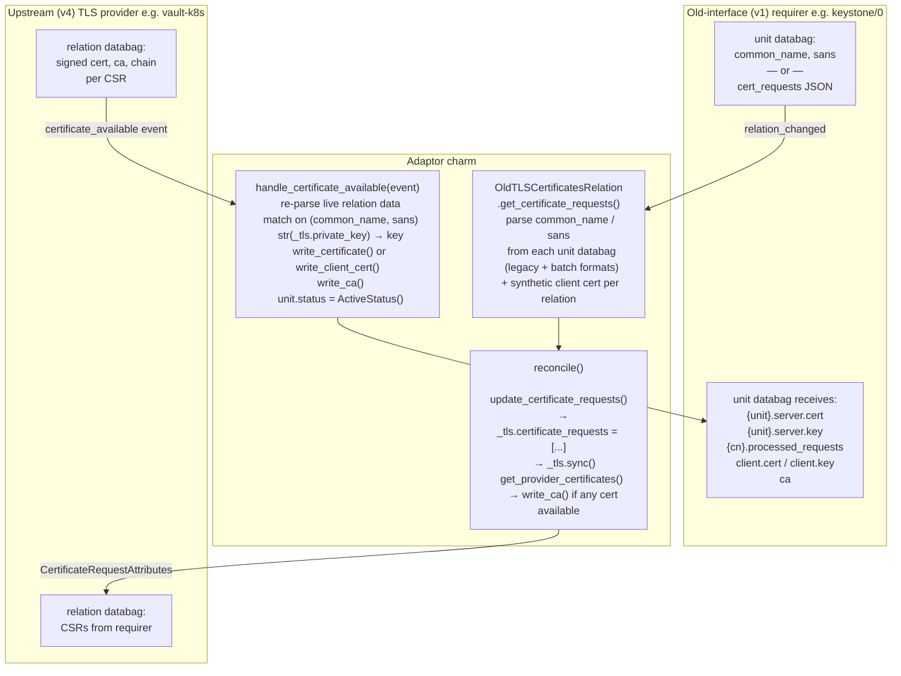
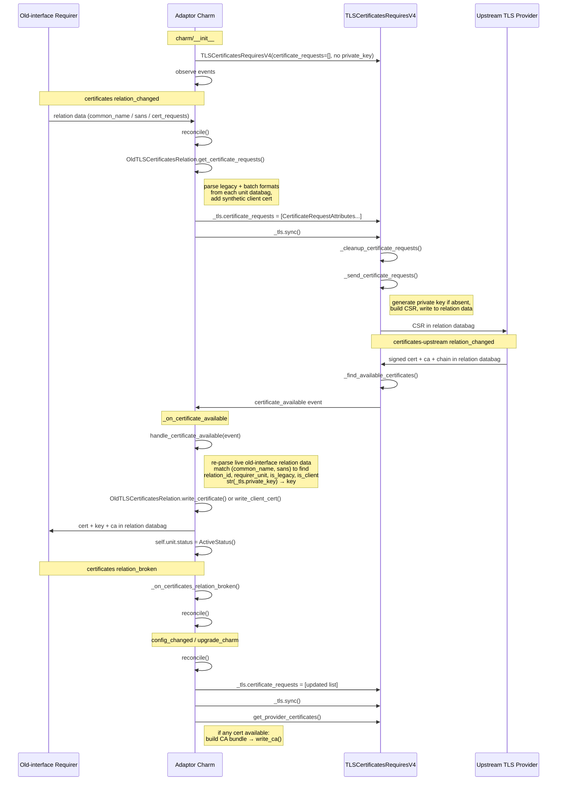

# Remove Private Key Management from Upstream TLS Certificates Relation

## Abstract

Remove the charm-owned RSA private key, all Juju Secret management, and the
`certificate_denied` handler from the TLS certificate adaptor charm. At
`certificate_available` time, all requirer routing information (`relation_id`,
`requirer_unit`, `is_legacy`, `is_client`) is re-derived from live old-interface
relation data instead of being stored in per-CSR mapping secrets. The upstream
library's internally-managed key is accessed via its `private_key` property when
delivering certificates to old-interface requirers.

## Goals

- Remove `private_key` argument from `TLSCertificatesRequiresV4` constructor call.
- Delete all charm-owned private key generation, storage, and retrieval.
- Delete `secret.py` entirely — no Juju Secrets are created or managed by the charm.
- Remove `process_relation`, `write_csr_fingerprints`, and `revoke_csr_mappings` from
  `OldTLSCertificatesRelation`; simplify `_on_certificates_relation_broken` to just call
  `reconcile()`.
- Remove the `certificate_denied` event handler.
- Construct `TLSCertificatesRequiresV4` with `certificate_requests=[]`; update
  `self._tls.certificate_requests` and call `self._tls.sync()` in `reconcile`.
- At `certificate_available` time, re-derive routing info by re-parsing live old-interface
  relation data using `get_certificate_requests()`, matching on `(common_name, sans)`.
- Replace `get_issued_certificates` with a direct call to `get_provider_certificates()` in
  `reconcile`.

## Non-Goals

- Changing the old-interface (v1) protocol behaviour; old requirers continue to receive the
  private key alongside the certificate.
- Modifying how the upstream library manages certificates or expiry/renewal.
- Providing a migration path for old deployments that stored the charm's private key in Juju
  Secrets or had `csr-fingerprints` in unit relation databags.

---

## Full Data Flow

The following diagram shows the complete data flow across all three layers: the old-interface
(v1) requirer, the adaptor charm, and the upstream (v4) TLS provider.



---

## Event Flow Timeline

The following diagram shows the sequence of events in chronological order and the functions
called during each event.



---

## Certificate Delivery Routing

At `certificate_available` time, `CertificateAvailableEvent` carries no `relation_id`. The
charm resolves the target requirer by:

1. Extracting `common_name` and `sans` from `event.certificate_signing_request` (parsed via
   `classify_sans` into dns/ip sets then recombined as a sorted list).
2. Calling `OldTLSCertificatesRelation.get_certificate_requests()` to re-parse all active
   old-interface relations.
3. Finding the first `CertificateRequest` whose `(common_name, sans)` matches.
4. Using the matched request's `relation_id`, `requirer_unit_name`, `is_legacy`, and
   `is_client` for delivery.

This is acceptable because the number of active old-interface relations is small (typically
one) and the live relation data is always present when the upstream provider responds.

---

## Changes by File

### `src/constants.py`

- Remove `CHARM_PRIVATE_KEY_SECRET_LABEL`, `CSR_FINGERPRINTS_KEY`, `JUJU_SECRET_LABEL_PREFIX`,
  `JUJU_SECRET_IS_LEGACY_KEY`, `JUJU_SECRET_IS_CLIENT_KEY`.
- Remove `CSR_MAPPING_IDS_KEY` (not needed; no identifiers are written to relation databags).

### `src/crypto.py`

- Remove `generate_private_key()`.
- Remove `build_csr()`.
- Remove `csr_sha256_hex()`.
- Remove `PrivateKey` import.
- Keep `classify_sans` and `build_ca_bundle`.

### `src/secret.py`

- **Delete entirely.**

### `src/models.py`

- Remove `IssuedCertificate` dataclass.

### `src/state.py`

- Remove `csr_fingerprints` field from `CharmState`.
- `CharmState.from_charm`: remove the `get_csr_fingerprints(certificate_requests)` call and the
  `csr_fingerprints=` argument from the `cls(...)` constructor call.

### `src/old_tls_certificate.py`

- `__init__`: remove `private_key_pem` parameter and `self._private_key_pem` attribute.
- Remove `get_csr_fingerprints` method entirely.
- Remove `process_relation` method entirely.
- Remove `write_csr_fingerprints` method entirely.
- Remove `revoke_csr_mappings` method entirely.
- Remove imports of `build_csr`, `csr_sha256_hex`, `get_csr_mapping`,
  `revoke_csr_mapping_by_fingerprint`, `store_csr_mapping`, `CSR_FINGERPRINTS_KEY`.
- `write_certificate`: keep `key` parameter; caller passes `str(self._tls.private_key)`.
- `write_client_cert`: keep `key` parameter; caller passes `str(self._tls.private_key)`.

### `src/new_tls_certificate.py`

- `__init__`: remove `private_key_pem` and `certificate_requests` parameters; construct
  `TLSCertificatesRequiresV4` with `certificate_requests=[]` and no `private_key`; remove
  `refresh_events` wiring for old-relation events.
- Add `update_certificate_requests(requests: list[CertificateRequest])`: converts `requests` to
  `CertificateRequestAttributes`, assigns to `self._tls.certificate_requests`, calls
  `self._tls.sync()`.
- `handle_certificate_available`: remove all secret lookups; extract `common_name` and `sans`
  from `event.certificate_signing_request`; call
  `old_handler.get_certificate_requests()` and iterate to find the matching
  `CertificateRequest` by `(common_name, sans)`; retrieve the key via
  `str(self._tls.private_key)` and pass as `key=` to `write_certificate` /
  `write_client_cert`; log an error and return if no match is found or if the old-interface
  relation is gone.
- Remove all imports from `secret`.
- `handle_certificate_denied`: delete entirely.
- `get_issued_certificates`: delete entirely.

### `src/charm.py`

- Remove `from secret import get_or_generate_private_key`.
- Remove `self._charm_key_pem = get_or_generate_private_key(self)`.
- Remove `CertificateDeniedEvent` from `charmlibs.interfaces.tls_certificates` import.
- Remove `private_key_pem` and `certificate_requests` arguments from
  `NewTLSCertificatesRelation(...)`.
- Remove `private_key_pem` argument from `OldTLSCertificatesRelation(...)`.
- Remove `self.framework.observe(self.tls_certificates.on.certificate_denied, ...)`.
- Remove `_on_certificate_denied` method.
- `_on_certificate_available`: remove `self.reconcile()`; replace with
  `self.unit.status = ops.ActiveStatus()`.
- `_on_certificates_relation_broken`: remove `self._old_handler.revoke_csr_mappings(...)`; keep
  only `self.reconcile()`.
- `reconcile`: call `self._upstream_handler.update_certificate_requests(requests)` (where
  `requests = self._old_handler.get_certificate_requests()`); replace
  `get_issued_certificates()` with:
  ```python
  if provider_certs := self.tls_certificates.get_provider_certificates():
      first = provider_certs[0]
      full_ca_pem = build_ca_bundle(
          str(first.ca), [str(c) for c in first.chain],
          str(first.certificate), self.state.extra_ca_certificates,
      )
      self._old_handler.write_ca(ca=full_ca_pem)
  ```

---

## Existing Deployment Migration

After upgrade, the following orphaned resources will remain in existing deployments:

1. A `tls-adaptor-private-key` Juju Secret — remove with `juju remove-secret`.
2. Per-CSR mapping secrets labelled `tls-adaptor-{csr_fingerprint}` — remove with
   `juju remove-secret`.
3. `csr-fingerprints` keys in unit relation databags — these are never read again and will
   remain inert until the relation is removed.

---

## Tests

- Delete `test_secret.py` entirely.
- Delete all tests for `build_csr`, `generate_private_key`, and `csr_sha256_hex` in
  `test_crypto.py`.
- Update `test_state.py`: remove `csr_fingerprints` assertions.
- Update `test_old_tls_certificate.py`: remove `private_key_pem` from constructor; remove
  tests for `process_relation`, `write_csr_fingerprints`, `revoke_csr_mappings`,
  `get_csr_fingerprints`.
- Update `test_new_tls_certificate.py`: remove `private_key_pem` and `certificate_requests`
  from constructor; mock `_tls.private_key`; test `update_certificate_requests` assigns
  `_tls.certificate_requests` and calls `_tls.sync()`; test `handle_certificate_available`
  calls `get_certificate_requests()` and matches on `(common_name, sans)`; delete tests for
  `handle_certificate_denied` and `get_issued_certificates`.
- Update `test_charm.py`: remove `_on_certificate_denied` tests; remove secret count assertions;
  update `reconcile` CA-bundle tests to mock `get_provider_certificates()`; verify
  `_on_certificate_available` sets `ActiveStatus` directly without calling `reconcile()`;
  verify `_on_certificates_relation_broken` only calls `reconcile()`.

## Further Information

### Architecture Decisions

- [ADR-1: Drop private_key from TLSCertificatesRequiresV4](./01-decision.md)

## References

- `docs/design/2026-05-11_remove-private-key-tls-relation/reference.md`
- `src/new_tls_certificate.py`
- `src/old_tls_certificate.py`
- `src/crypto.py`
- `src/models.py`
- `src/state.py`
- `src/charm.py`
